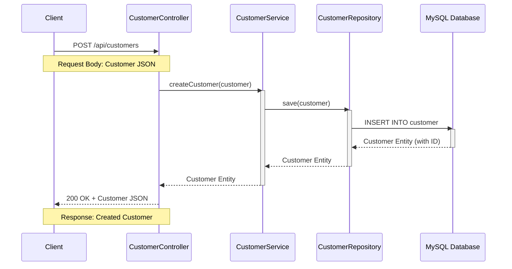
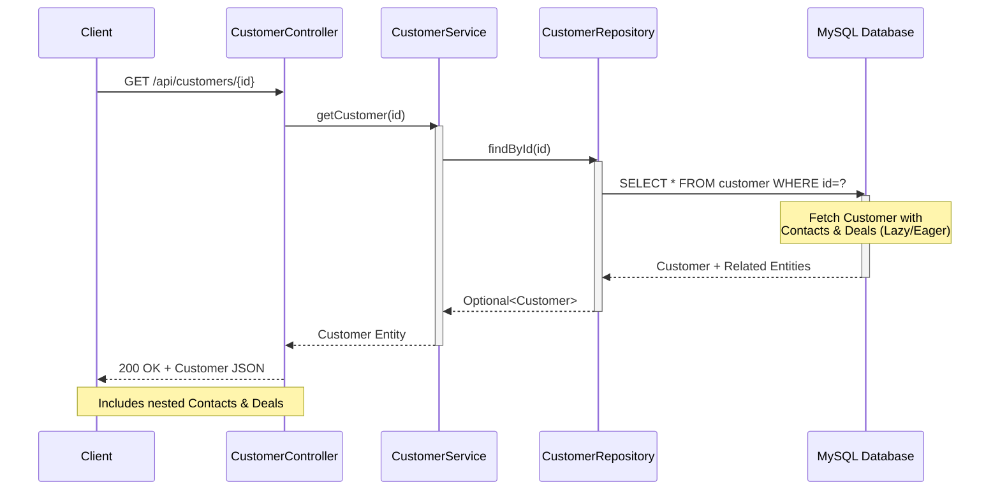
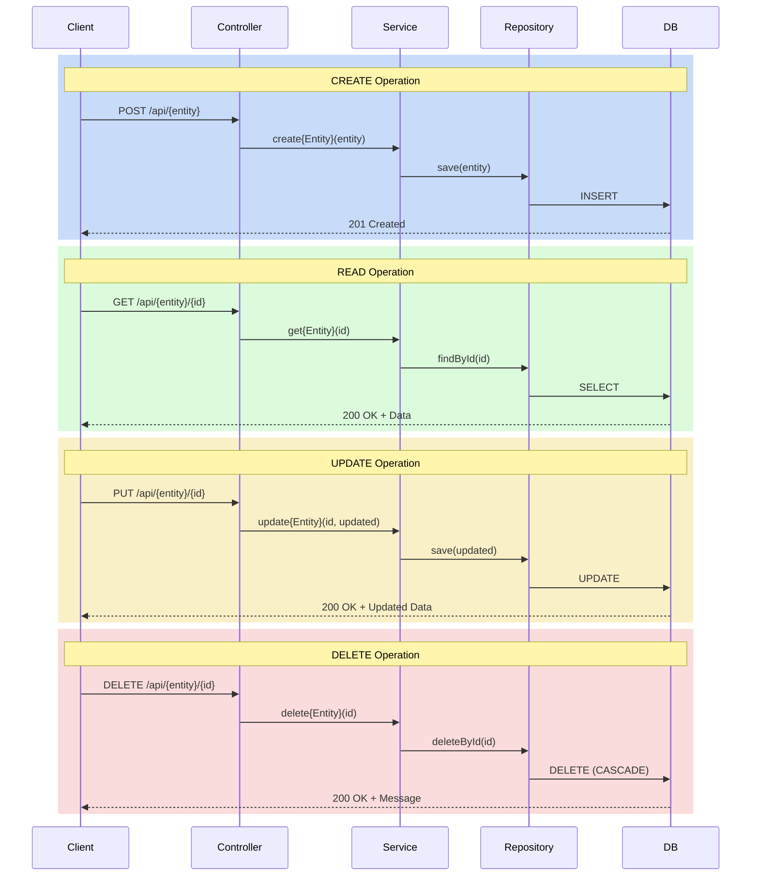
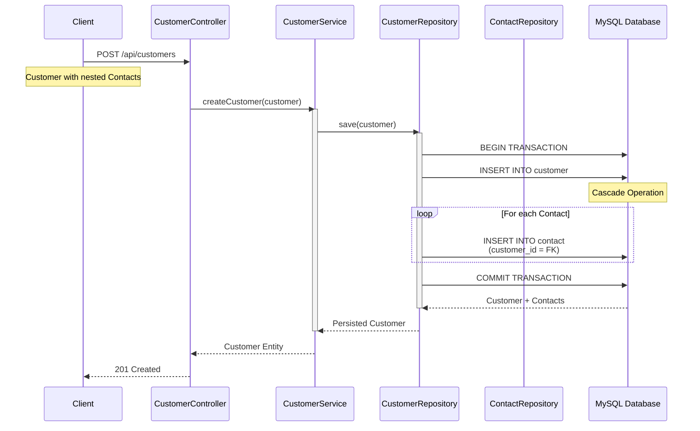
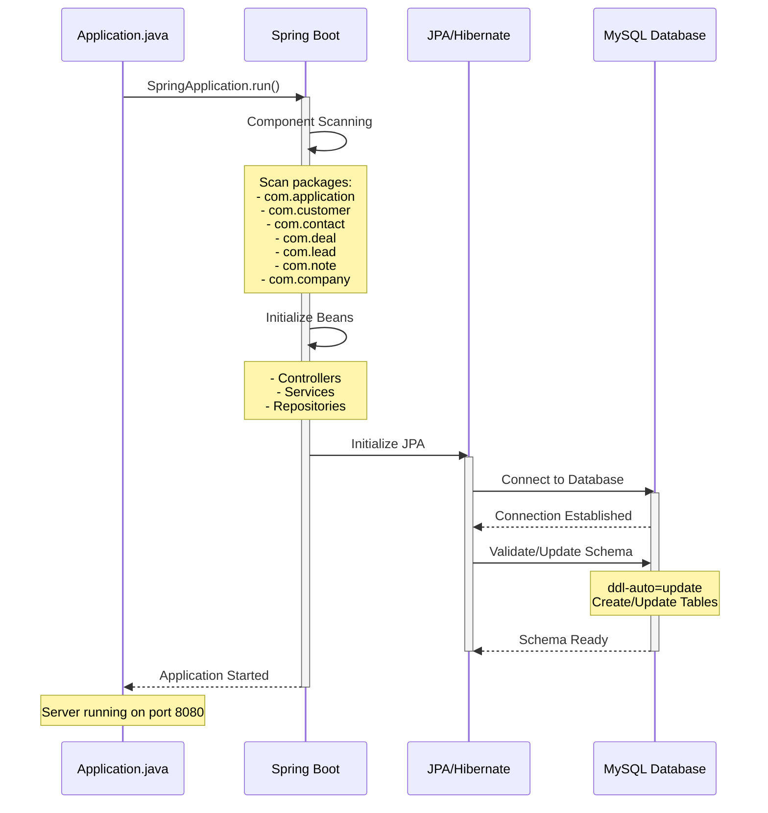
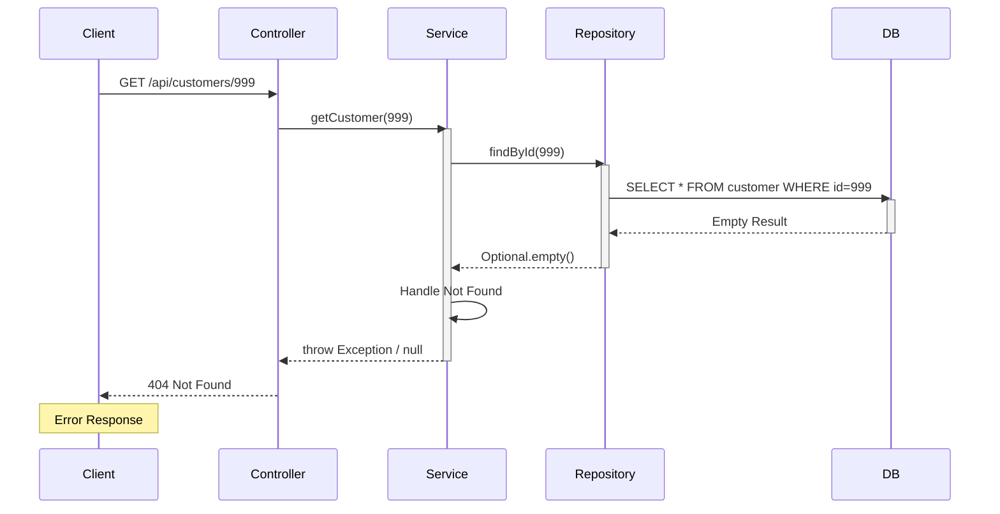

<div align="center">

```
╔══════════════════════════════════════════════════════════════════════════════╗
║                                                                              ║
║     ███████╗███╗   ██╗████████╗██╗████████╗██╗   ██╗                         ║
║     ██╔════╝████╗  ██║╚══██╔══╝██║╚══██╔══╝╚██╗ ██╔╝                         ║
║     █████╗  ██╔██╗ ██║   ██║   ██║   ██║    ╚████╔╝                          ║
║     ██╔══╝  ██║╚██╗██║   ██║   ██║   ██║     ╚██╔╝                           ║
║     ███████╗██║ ╚████║   ██║   ██║   ██║      ██║                            ║
║     ╚══════╝╚═╝  ╚═══╝   ╚═╝   ╚═╝   ╚═╝      ╚═╝                            ║
║                                                                              ║
║              ███╗   ███╗ █████╗ ██████╗ ██████╗ ██╗███╗   ██╗ ██████╗        ║
║              ████╗ ████║██╔══██╗██╔══██╗██╔══██╗██║████╗  ██║██╔════╝        ║
║              ██╔████╔██║███████║██████╔╝██████╔╝██║██╔██╗ ██║██║  ███╗       ║
║              ██║╚██╔╝██║██╔══██║██╔═══╝ ██╔═══╝ ██║██║╚██╗██║██║   ██║       ║
║              ██║ ╚═╝ ██║██║  ██║██║     ██║     ██║██║ ╚████║╚██████╔╝       ║
║              ╚═╝     ╚═╝╚═╝  ╚═╝╚═╝     ╚═╝     ╚═╝╚═╝  ╚═══╝ ╚═════╝        ║
║                                                                              ║
╚══════════════════════════════════════════════════════════════════════════════╝
```

# 🚀 Entity Mapping - Spring Boot JPA Project

[](https://www.oracle.com/java/)
[](https://spring.io/projects/spring-boot)
[](https://maven.apache.org/)
[](https://www.mysql.com/)
[](https://opensource.org/licenses/MIT)

**A comprehensive Spring Boot application demonstrating JPA entity relationships and RESTful API design**

[Features](#-features) • [Tech Stack](#-tech-stack) • [Getting Started](#-getting-started) • [API Documentation](#-api-documentation) • [License](#-license)

</div>

---

## 📋 Table of Contents

- [Overview](#-overview)
- [Features](#-features)
- [Tech Stack](#-tech-stack)
- [Project Structure](#-project-structure)
- [Getting Started](#-getting-started)
  - [Prerequisites](#prerequisites)
  - [Installation](#installation)
  - [Configuration](#configuration)
  - [Running the Application](#running-the-application)
- [API Documentation](#-api-documentation)
- [Database Schema](#-database-schema)
- [Contributing](#-contributing)
- [License](#-license)

---

## 🎯 Overview

**Entity Mapping** is a Spring Boot learning project that demonstrates various JPA entity relationships including One-to-Many, Many-to-One, and cascading operations. This project implements a CRM-like system with entities for Customers, Contacts, Deals, Leads, Notes, and Companies.

This project serves as a practical reference for understanding:
- JPA/Hibernate entity relationships
- Spring Data JPA repositories
- RESTful API design patterns
- Service layer architecture
- MySQL database integration

---

## ✨ Features

- ✅ **Complete CRUD Operations** for all entities
- ✅ **JPA Entity Relationships**: One-to-Many, Many-to-One mappings
- ✅ **RESTful API Endpoints** with proper HTTP methods
- ✅ **Service Layer Pattern** with interface-based design
- ✅ **MySQL Database Integration** with automatic schema generation
- ✅ **Spring Boot DevTools** for hot reload during development
- ✅ **Component Scanning** across multiple packages
- ✅ **Cascade Operations** for related entities

---

## 🛠️ Tech Stack

| Technology | Version | Purpose |
|------------|---------|---------|
| **Java** | 21 | Programming Language |
| **Spring Boot** | 4.0.1 | Application Framework |
| **Spring Data JPA** | 4.0.1 | Data Access Layer |
| **Hibernate** | (via Spring Boot) | ORM Framework |
| **MySQL** | 8.0+ | Relational Database |
| **Maven** | 4.0.0 | Build Tool |
| **Spring Boot DevTools** | 4.0.1 | Development Utilities |

---

## 📁 Project Structure

```
EntityMapping/
├── src/
│   ├── main/
│   │   ├── java/
│   │   │   └── com/
│   │   │       ├── application/
│   │   │       │   └── Application.java          # Main Spring Boot Application
│   │   │       ├── company/
│   │   │       │   ├── Company.java              # Company Entity
│   │   │       │   ├── CompanyController.java    # REST Controller
│   │   │       │   ├── CompanyService.java       # Service Interface
│   │   │       │   ├── CompanyServiceImpl.java   # Service Implementation
│   │   │       │   └── CompanyRepository.java    # JPA Repository
│   │   │       ├── customer/
│   │   │       │   ├── Customer.java             # Customer Entity (One-to-Many)
│   │   │       │   ├── CustomerController.java
│   │   │       │   ├── CustomerService.java
│   │   │       │   ├── CustomerServiceImpl.java
│   │   │       │   └── CustomerRepository.java
│   │   │       ├── contact/
│   │   │       │   └── ...                       # Contact Entity & Components
│   │   │       ├── deal/
│   │   │       │   └── ...                       # Deal Entity & Components
│   │   │       ├── lead/
│   │   │       │   └── ...                       # Lead Entity & Components
│   │   │       └── note/
│   │   │           └── ...                       # Note Entity & Components
│   │   └── resources/
│   │       └── application.properties            # Application Configuration
│   └── test/
│       └── java/                                 # Test Classes
├── pom.xml                                       # Maven Dependencies
└── README.md                                     # This File
```

---

## 🚀 Getting Started

### Prerequisites

Before you begin, ensure you have the following installed:

- **Java Development Kit (JDK) 21** or higher
  ```bash
  java -version
  ```

- **Maven 3.6+** (or use the included Maven wrapper)
  ```bash
  mvn -version
  ```

- **MySQL 8.0+** installed and running
  ```bash
  mysql --version
  ```

- **Git** for cloning the repository
  ```bash
  git --version
  ```

---

### Installation

1. **Clone the repository**
   ```bash
   git clone https://github.com/yourusername/Java_Backend.git
   cd Java_Backend/EntityMapping
   ```

2. **Create MySQL Database**
   ```bash
   mysql -u root -p
   ```
   
   Then execute:
   ```sql
   CREATE DATABASE entitymapping;
   EXIT;
   ```

3. **Configure Database Connection**
   
   Edit `src/main/resources/application.properties` and update with your MySQL credentials:
   ```properties
   spring.datasource.username=your_mysql_username
   spring.datasource.password=your_mysql_password
   ```

4. **Install Dependencies**
   ```bash
   mvn clean install
   ```
   
   Or using Maven wrapper:
   ```bash
   ./mvnw clean install
   ```

---

### Configuration

The application can be configured via `src/main/resources/application.properties`:

```properties
# Application Name
spring.application.name=EntityMapping

# Database Configuration
spring.datasource.url=jdbc:mysql://localhost:3306/entitymapping?useSSL=false&allowPublicKeyRetrieval=true&serverTimezone=UTC
spring.datasource.username=root
spring.datasource.password=YourPassword

# JPA/Hibernate Configuration
spring.jpa.hibernate.ddl-auto=update
spring.jpa.show-sql=true

# Server Configuration (Optional)
# server.port=9090
```

**Configuration Options:**
- `spring.jpa.hibernate.ddl-auto=update` - Automatically updates database schema
- `spring.jpa.show-sql=true` - Logs SQL queries to console
- Uncomment `server.port` to change default port (8080)

---

### Running the Application

1. **Using Maven**
   ```bash
   mvn spring-boot:run
   ```

2. **Using Maven Wrapper**
   ```bash
   ./mvnw spring-boot:run
   ```

3. **Using Java directly**
   ```bash
   mvn clean package
   java -jar target/EntityMapping-0.0.1-SNAPSHOT.jar
   ```

4. **Verify the application is running**
   
   The application will start on `http://localhost:8080` (or your configured port)
   
   You should see output similar to:
   ```
   Started Application in X.XXX seconds
   ```

---

## 📡 API Documentation

### Base URL
```
http://localhost:8080
```

### Available Endpoints

#### 🏢 Company Endpoints
- `GET /companies` - Get all companies
- `GET /companies/{id}` - Get company by ID
- `POST /companies` - Create new company
- `PUT /companies/{id}` - Update company
- `DELETE /companies/{id}` - Delete company

#### 👥 Customer Endpoints
- `GET /customers` - Get all customers
- `GET /customers/{id}` - Get customer by ID
- `POST /customers` - Create new customer
- `PUT /customers/{id}` - Update customer
- `DELETE /customers/{id}` - Delete customer

#### 📞 Contact Endpoints
- `GET /contacts` - Get all contacts
- `GET /contacts/{id}` - Get contact by ID
- `POST /contacts` - Create new contact
- `PUT /contacts/{id}` - Update contact
- `DELETE /contacts/{id}` - Delete contact

#### 💼 Deal Endpoints
- `GET /deals` - Get all deals
- `GET /deals/{id}` - Get deal by ID
- `POST /deals` - Create new deal
- `PUT /deals/{id}` - Update deal
- `DELETE /deals/{id}` - Delete deal

#### 🎯 Lead Endpoints
- `GET /leads` - Get all leads
- `GET /leads/{id}` - Get lead by ID
- `POST /leads` - Create new lead
- `PUT /leads/{id}` - Update lead
- `DELETE /leads/{id}` - Delete lead

#### 📝 Note Endpoints
- `GET /notes` - Get all notes
- `GET /notes/{id}` - Get note by ID
- `POST /notes` - Create new note
- `PUT /notes/{id}` - Update note
- `DELETE /notes/{id}` - Delete note

### Example API Calls

**Create a Customer:**
```bash
curl -X POST http://localhost:8080/customers \
  -H "Content-Type: application/json" \
  -d '{
    "name": "Acme Corporation",
    "industry": "Technology"
  }'
```

**Get All Customers:**
```bash
curl http://localhost:8080/customers
```

---

## 🗄️ Database Schema

The application uses the following entity relationships:

```
Customer (1) ──────< (N) Contact
    │
    └──────< (N) Deal

(Other entities follow similar patterns)
```

**Key Relationships:**
- **Customer → Contacts**: One-to-Many (One customer can have multiple contacts)
- **Customer → Deals**: One-to-Many (One customer can have multiple deals)
- **Cascade Operations**: Enabled for automatic persistence of related entities

---

## 📊 Sequence Diagram

The following sequence diagrams illustrate the request flow through the application layers:

### CRUD Operation Flow (Example: Create Customer)



### GET Operation with Relationships



### Complete CRUD Operations Flow



### Entity Relationship Flow (Customer with Contacts)



### Application Startup Sequence



### Error Handling Flow



**Key Components:**
- **Controller Layer**: Handles HTTP requests/responses, validates input
- **Service Layer**: Contains business logic, transaction management
- **Repository Layer**: Data access abstraction using Spring Data JPA
- **Database**: MySQL persistence with automatic schema management
- **Cascade Operations**: Automatic persistence of related entities (One-to-Many)

---

## 🤝 Contributing

Contributions are welcome! Please feel free to submit a Pull Request.

1. Fork the repository
2. Create your feature branch (`git checkout -b feature/AmazingFeature`)
3. Commit your changes (`git commit -m 'Add some AmazingFeature'`)
4. Push to the branch (`git push origin feature/AmazingFeature`)
5. Open a Pull Request

---

## 📄 License

This project is licensed under the **MIT License** - see below for details:

```
MIT License

Copyright (c) 2024 Java Backend Projects

Permission is hereby granted, free of charge, to any person obtaining a copy
of this software and associated documentation files (the "Software"), to deal
in the Software without restriction, including without limitation the rights
to use, copy, modify, merge, publish, distribute, sublicense, and/or sell
copies of the Software, and to permit persons to whom the Software is
furnished to do so, subject to the following conditions:

The above copyright notice and this permission notice shall be included in all
copies or substantial portions of the Software.

THE SOFTWARE IS PROVIDED "AS IS", WITHOUT WARRANTY OF ANY KIND, EXPRESS OR
IMPLIED, INCLUDING BUT NOT LIMITED TO THE WARRANTIES OF MERCHANTABILITY,
FITNESS FOR A PARTICULAR PURPOSE AND NONINFRINGEMENT. IN NO EVENT SHALL THE
AUTHORS OR COPYRIGHT HOLDERS BE LIABLE FOR ANY CLAIM, DAMAGES OR OTHER
LIABILITY, WHETHER IN AN ACTION OF CONTRACT, TORT OR OTHERWISE, ARISING FROM,
OUT OF OR IN CONNECTION WITH THE SOFTWARE OR THE USE OR OTHER DEALINGS IN THE
SOFTWARE.
```

---

## 📞 Contact & Support

For questions or support, please open an issue in the GitHub repository.

---

<div align="center">

**⭐ If you find this project helpful, please consider giving it a star!**

Made with ❤️ using Spring Boot

</div>
