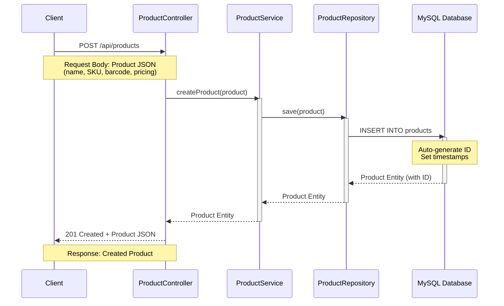
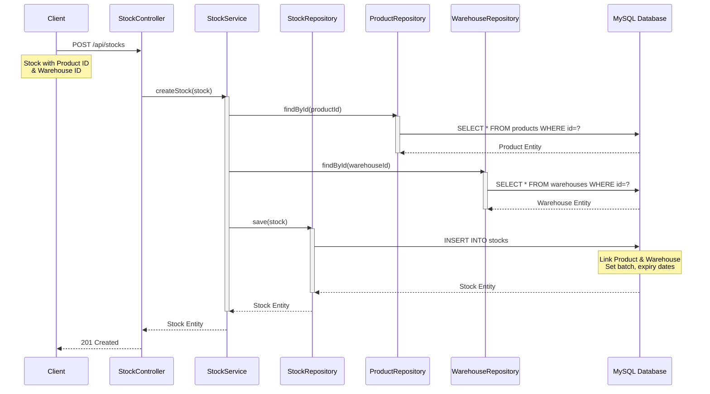
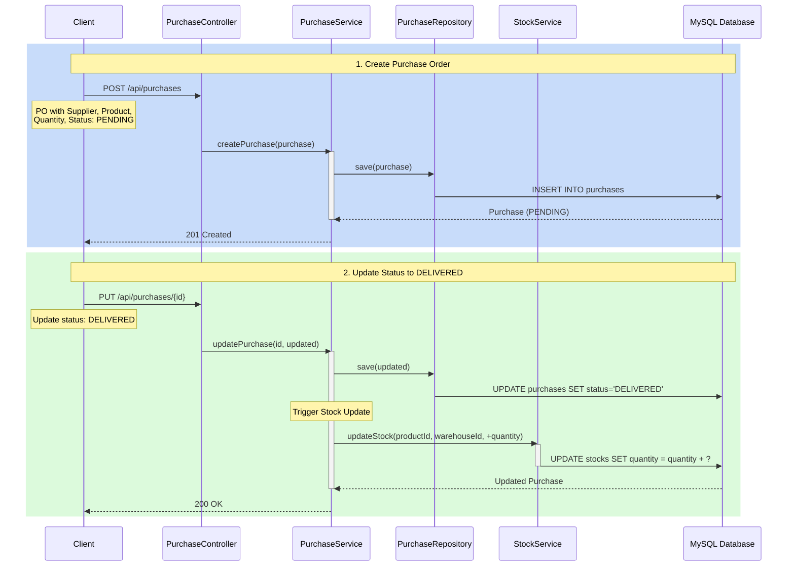
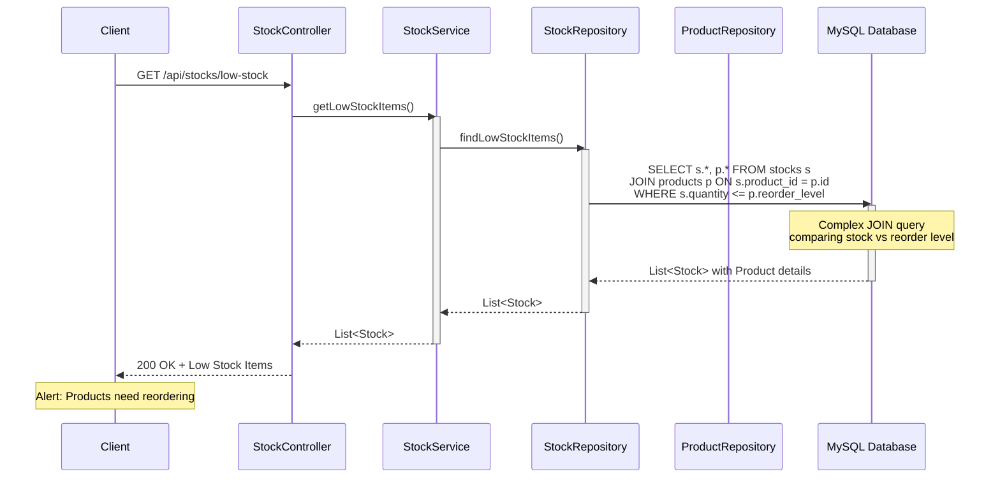
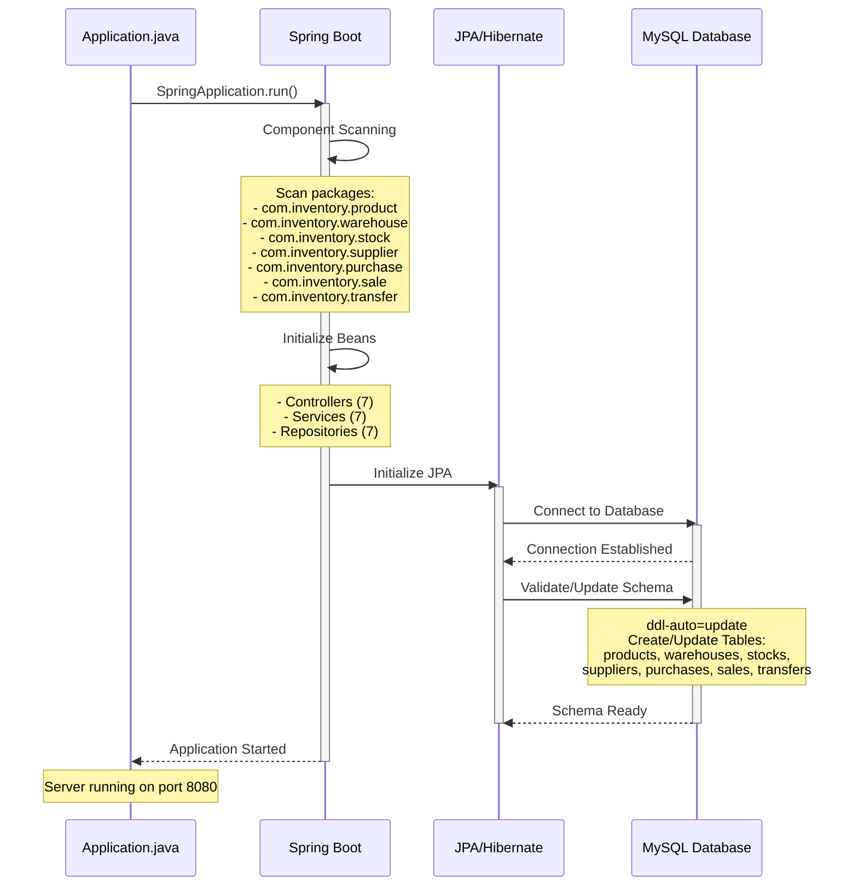
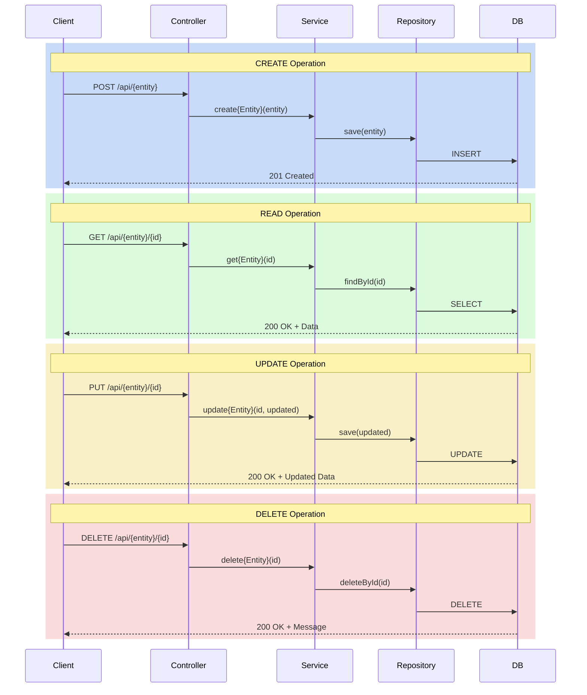
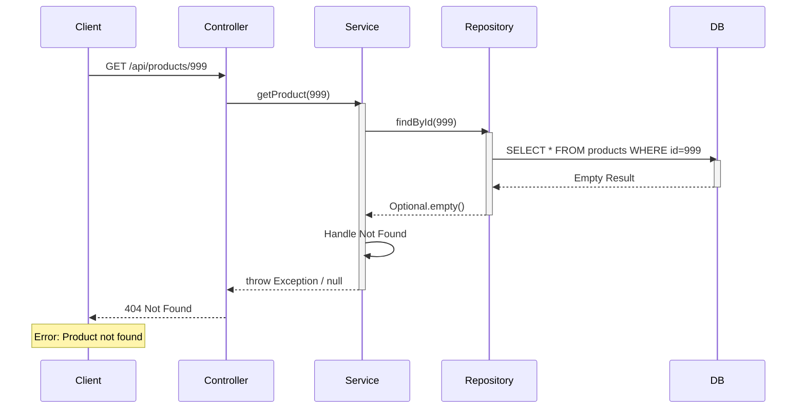

<div align="center">

```
╔════════════════════════════════════════════════════════════════════════════════════════════════════╗
║                                                                                                    ║
║     ██╗███╗   ██╗██╗   ██╗███████╗███╗   ██╗████████╗ ██████╗ ██████╗██╗   ██╗                     ║
║     ██║████╗  ██║██║   ██║██╔════╝████╗  ██║╚══██╔══╝██╔═══██╗██╔══██╗╚██╗ ██╔╝                    ║
║     ██║██╔██╗ ██║██║   ██║█████╗  ██╔██╗ ██║   ██║   ██║   ██║██████╔╝ ╚████╔╝                     ║
║     ██║██║╚██╗██║╚██╗ ██╔╝██╔══╝  ██║╚██╗██║   ██║   ██║   ██║██╔══██╗  ╚██╔╝                      ║
║     ██║██║ ╚████║ ╚████╔╝ ███████╗██║ ╚████║   ██║   ╚██████╔╝██║  ██║   ██║                       ║
║     ╚═╝╚═╝  ╚═══╝  ╚═══╝  ╚══════╝╚═╝  ╚═══╝   ╚═╝    ╚═════╝ ╚═╝  ╚═╝   ╚═╝                       ║
║                                                                                                    ║
║     ███╗   ███╗ █████╗ ███╗   ██╗ █████╗  ██████╗ ███████╗███╗   ███╗███████╗███╗   ██╗████████╗   ║
║     ████╗ ████║██╔══██╗████╗  ██║██╔══██╗██╔════╝ ██╔════╝████╗ ████║██╔════╝████╗  ██║╚══██╔══╝   ║
║     ██╔████╔██║███████║██╔██╗ ██║███████║██║  ███╗█████╗  ██╔████╔██║█████╗  ██╔██╗ ██║   ██║      ║
║     ██║╚██╔╝██║██╔══██║██║╚██╗██║██╔══██║██║   ██║██╔══╝  ██║╚██╔╝██║██╔══╝  ██║╚██╗██║   ██║      ║
║     ██║ ╚═╝ ██║██║  ██║██║ ╚████║██║  ██║╚██████╔╝███████╗██║ ╚═╝ ██║███████╗██║ ╚████║   ██║      ║
║     ╚═╝     ╚═╝╚═╝  ╚═╝╚═╝  ╚═══╝╚═╝  ╚═╝ ╚═════╝ ╚══════╝╚═╝     ╚═╝╚══════╝╚═╝  ╚═══╝   ╚═╝      ║
║                                                                                                    ║
╚════════════════════════════════════════════════════════════════════════════════════════════════════╝
```

# 📦 Inventory Management System

[](https://www.oracle.com/java/)
[](https://spring.io/projects/spring-boot)
[](https://maven.apache.org/)
[](https://www.mysql.com/)
[](https://opensource.org/licenses/MIT)

**A comprehensive Spring Boot application for multi-warehouse inventory management with advanced tracking and analytics**

[Features](#-features) • [Tech Stack](#-tech-stack) • [Getting Started](#-getting-started) • [API Documentation](#-api-documentation) • [License](#-license)

</div>

---

## 📋 Table of Contents

- [Overview](#-overview)
- [Features](#-features)
- [Tech Stack](#-tech-stack)
- [Entities](#-entities)
- [Getting Started](#-getting-started)
- [API Documentation](#-api-documentation)
- [Database Schema](#-database-schema)
- [License](#-license)

---

## 🎯 Overview

**Inventory Management System** is an enterprise-grade Spring Boot application designed for comprehensive inventory tracking across multiple warehouses. It provides complete functionality for managing products, stock levels, suppliers, purchases, sales, and inter-warehouse transfers with advanced features like batch tracking, expiry management, and inventory valuation.

This project demonstrates:
- Multi-warehouse inventory management
- Complex JPA entity relationships
- RESTful API design with comprehensive endpoints
- Service layer architecture with business logic
- Advanced querying and reporting capabilities

---

## ✨ Features

### Core Features
- ✅ **Multi-Warehouse Support** - Track inventory across multiple warehouse locations
- ✅ **Product Management** - Comprehensive product catalog with SKU and barcode support
- ✅ **Stock Tracking** - Real-time stock levels with batch and lot number tracking
- ✅ **Supplier Management** - Vendor management with ratings and payment terms
- ✅ **Purchase Orders** - Complete purchase order lifecycle management
- ✅ **Sales Orders** - Sales order processing with payment tracking
- ✅ **Stock Transfers** - Inter-warehouse stock transfer with approval workflow

### Advanced Features
- 📊 **Inventory Valuation** - Support for FIFO, LIFO, and Average costing methods
- 📅 **Expiry Tracking** - Batch and expiry date management for perishable goods
- 🔔 **Low Stock Alerts** - Automatic alerts when stock falls below reorder levels
- 📈 **Analytics Ready** - Date range queries for reporting and forecasting
- 🏷️ **Barcode/QR Support** - Product identification via barcode scanning
- 💰 **Financial Tracking** - Cost price, selling price, and profit margin tracking

---

## 🛠️ Tech Stack

| Technology | Version | Purpose |
|------------|---------|---------|
| **Java** | 21 | Programming Language |
| **Spring Boot** | 4.0.1 | Application Framework |
| **Spring Data JPA** | 4.0.1 | Data Access Layer |
| **Hibernate** | (via Spring Boot) | ORM Framework |
| **MySQL** | 8.0+ | Relational Database |
| **Maven** | 4.0.0 | Build Tool |
| **Spring Boot DevTools** | 4.0.1 | Development Utilities |

---

## 📦 Entities

### 1. Product
Represents items in the inventory system
- Product information (name, SKU, barcode, description)
- Pricing (cost price, selling price)
- Category and unit of measurement
- Reorder level for low stock alerts

### 2. Warehouse
Represents storage locations
- Warehouse identification (code, name)
- Location details (address, city, state, country)
- Contact information
- Capacity tracking
- Active/inactive status

### 3. Stock
Tracks inventory levels in warehouses
- Product-warehouse relationship
- Quantity tracking
- Batch and lot number
- Expiry and manufacturing dates
- Valuation method (FIFO/LIFO/Average)

### 4. Supplier
Manages vendor information
- Supplier details (code, name, contact)
- Payment terms and credit limit
- Rating system (1-5 stars)
- Active/inactive status

### 5. Purchase
Purchase order management
- Order tracking (PO number, dates)
- Supplier and product relationship
- Quantity and pricing
- Order status (Pending, Confirmed, Shipped, Delivered, Cancelled)
- Batch and expiry tracking

### 6. Sale
Sales order processing
- Order tracking (SO number, dates)
- Customer information
- Quantity, pricing, discount, and tax
- Payment status (Unpaid, Partially Paid, Paid, Refunded)
- Order status (Pending, Confirmed, Processing, Shipped, Delivered, Cancelled, Returned)

### 7. Transfer
Inter-warehouse stock transfers
- Transfer tracking (transfer number, dates)
- Source and destination warehouses
- Product and quantity
- Transfer status (Pending, Approved, In Transit, Received, Cancelled, Rejected)
- Approval workflow (initiated by, approved by, received by)

---

## 🚀 Getting Started

### Prerequisites

- **Java Development Kit (JDK) 21** or higher
- **Maven 3.6+**
- **MySQL 8.0+** installed and running
- **Git** for cloning the repository

### Installation

1. **Clone the repository**
   ```bash
   git clone https://github.com/Dronanaik/Java_Backend.git
   cd Java_Backend/InventoryManagement
   ```

2. **Create MySQL Database**
   ```bash
   mysql -u root -p
   ```
   
   Then execute:
   ```sql
   CREATE DATABASE inventory_management;
   EXIT;
   ```

3. **Configure Database Connection**
   
   Edit `src/main/resources/application.properties`:
   ```properties
   spring.datasource.username=your_mysql_username
   spring.datasource.password=your_mysql_password
   ```

4. **Install Dependencies**
   ```bash
   mvn clean install
   ```

### Running the Application

```bash
mvn spring-boot:run
```

The application will start on `http://localhost:8080`

---

## 📡 API Documentation

### Base URL
```
http://localhost:8080/api
```

### Product Endpoints
- `GET /products` - Get all products
- `GET /products/{id}` - Get product by ID
- `GET /products/sku/{sku}` - Get product by SKU
- `GET /products/barcode/{barcode}` - Get product by barcode
- `GET /products/category/{category}` - Get products by category
- `GET /products/search?name={name}` - Search products by name
- `POST /products` - Create new product
- `PUT /products/{id}` - Update product
- `DELETE /products/{id}` - Delete product

### Warehouse Endpoints
- `GET /warehouses` - Get all warehouses
- `GET /warehouses/{id}` - Get warehouse by ID
- `GET /warehouses/code/{code}` - Get warehouse by code
- `GET /warehouses/active` - Get active warehouses
- `GET /warehouses/city/{city}` - Get warehouses by city
- `POST /warehouses` - Create new warehouse
- `PUT /warehouses/{id}` - Update warehouse
- `DELETE /warehouses/{id}` - Delete warehouse

### Stock Endpoints
- `GET /stocks` - Get all stocks
- `GET /stocks/{id}` - Get stock by ID
- `GET /stocks/product/{productId}` - Get stocks by product
- `GET /stocks/warehouse/{warehouseId}` - Get stocks by warehouse
- `GET /stocks/product/{productId}/warehouse/{warehouseId}` - Get stock by product and warehouse
- `GET /stocks/expiring?beforeDate={date}` - Get expiring stocks
- `GET /stocks/low-stock` - Get low stock items
- `POST /stocks` - Create new stock
- `PUT /stocks/{id}` - Update stock
- `DELETE /stocks/{id}` - Delete stock

### Supplier Endpoints
- `GET /suppliers` - Get all suppliers
- `GET /suppliers/{id}` - Get supplier by ID
- `GET /suppliers/code/{code}` - Get supplier by code
- `GET /suppliers/active` - Get active suppliers
- `GET /suppliers/rating/{rating}` - Get suppliers by rating
- `POST /suppliers` - Create new supplier
- `PUT /suppliers/{id}` - Update supplier
- `DELETE /suppliers/{id}` - Delete supplier

### Purchase Endpoints
- `GET /purchases` - Get all purchases
- `GET /purchases/{id}` - Get purchase by ID
- `GET /purchases/order/{orderNumber}` - Get purchase by order number
- `GET /purchases/supplier/{supplierId}` - Get purchases by supplier
- `GET /purchases/status/{status}` - Get purchases by status
- `GET /purchases/date-range?startDate={start}&endDate={end}` - Get purchases by date range
- `POST /purchases` - Create new purchase
- `PUT /purchases/{id}` - Update purchase
- `DELETE /purchases/{id}` - Delete purchase

### Sale Endpoints
- `GET /sales` - Get all sales
- `GET /sales/{id}` - Get sale by ID
- `GET /sales/order/{orderNumber}` - Get sale by order number
- `GET /sales/status/{status}` - Get sales by status
- `GET /sales/payment-status/{paymentStatus}` - Get sales by payment status
- `GET /sales/date-range?startDate={start}&endDate={end}` - Get sales by date range
- `GET /sales/customer?name={name}` - Search sales by customer name
- `POST /sales` - Create new sale
- `PUT /sales/{id}` - Update sale
- `DELETE /sales/{id}` - Delete sale

### Transfer Endpoints
- `GET /transfers` - Get all transfers
- `GET /transfers/{id}` - Get transfer by ID
- `GET /transfers/number/{transferNumber}` - Get transfer by number
- `GET /transfers/from-warehouse/{warehouseId}` - Get transfers from warehouse
- `GET /transfers/to-warehouse/{warehouseId}` - Get transfers to warehouse
- `GET /transfers/status/{status}` - Get transfers by status
- `POST /transfers` - Create new transfer
- `PUT /transfers/{id}` - Update transfer
- `DELETE /transfers/{id}` - Delete transfer

---

## 🗄️ Database Schema

The application uses complex JPA relationships:

```
Product (1) ────< (N) Stock >──── (1) Warehouse
                    │
Supplier (1) ────< (N) Purchase >──── (1) Product
                                 >──── (1) Warehouse

Product (1) ────< (N) Sale >──── (1) Warehouse

Product (1) ────< (N) Transfer
Warehouse (1) ──< (N) Transfer (from)
Warehouse (1) ──< (N) Transfer (to)
```

**Key Relationships:**
- **Product → Stock**: One-to-Many (One product can exist in multiple warehouses)
- **Warehouse → Stock**: One-to-Many (One warehouse can store multiple products)
- **Supplier → Purchase**: One-to-Many (One supplier can have multiple purchase orders)
- **Product → Purchase/Sale/Transfer**: One-to-Many relationships for tracking

---

## � Sequence Diagrams

The following sequence diagrams illustrate the request flow through the application layers for various inventory management operations:

### CRUD Operation Flow (Example: Create Product)



### Stock Management Flow (Create/Update Stock)



### Purchase Order Flow (Complete Lifecycle)



### Sale Order Processing Flow

```mermaid
sequenceDiagram
    participant Client
    participant SaleController
    participant SaleService
    participant SaleRepo as SaleRepository
    participant StockService
    participant StockRepo as StockRepository
    participant DB as MySQL Database

    Client->>SaleController: POST /api/sales
    Note over Client: Sale Order with<br/>Product, Quantity, Customer

    SaleController->>SaleService: createSale(sale)
    activate SaleService

    SaleService->>StockService: checkAvailability(productId, warehouseId, quantity)
    activate StockService
    StockService->>StockRepo: findByProductAndWarehouse(productId, warehouseId)
    StockRepo->>DB: SELECT * FROM stocks WHERE...
    DB-->>StockRepo: Stock Entity
    StockRepo-->>StockService: Stock Entity
    StockService-->>SaleService: Stock availability result
    deactivate StockService
    
    alt Stock Available
        SaleService->>SaleRepo: save(sale)
        activate SaleRepo
        SaleRepo->>DB: INSERT INTO sales
        DB-->>SaleRepo: Sale Entity
        SaleRepo-->>SaleService: Sale Entity
        deactivate SaleRepo
        
        SaleService->>StockService: reduceStock(productId, warehouseId, quantity)
        activate StockService
        StockService->>DB: UPDATE stocks SET quantity = quantity - ?
        DB-->>StockService: Updated
        StockService-->>SaleService: Success
        deactivate StockService
        
        SaleService-->>SaleController: Sale Entity
        SaleController-->>Client: 201 Created
        deactivate SaleService
    else Insufficient Stock
        SaleService-->>SaleController: Error: Insufficient Stock
        SaleController-->>Client: 400 Bad Request
        deactivate SaleService
    end
```

### Inter-Warehouse Transfer Flow

```mermaid
sequenceDiagram
    participant Client
    participant TransferController
    participant TransferService
    participant TransferRepo as TransferRepository
    participant StockService
    participant DB as MySQL Database

    Note over Client,DB: Phase 1 - Initiate Transfer
    Client->>TransferController: POST /api/transfers
    Note over Client: Transfer Request:<br/>From Warehouse A to B<br/>Product, Quantity

    TransferController->>TransferService: createTransfer(transfer)
    activate TransferService
    
    TransferService->>StockService: checkStock(productId, fromWarehouseId, quantity)
    activate StockService
    StockService->>DB: SELECT quantity FROM stocks
    DB-->>StockService: Available Quantity
    StockService-->>TransferService: Stock check result
    deactivate StockService
    
    alt Stock Available
        TransferService->>TransferRepo: save(transfer)
        activate TransferRepo
        TransferRepo->>DB: INSERT INTO transfers (status='PENDING')
        DB-->>TransferRepo: Transfer (PENDING)
        TransferRepo-->>TransferService: Transfer (PENDING)
        deactivate TransferRepo
        TransferService-->>TransferController: Transfer Entity
        TransferController-->>Client: 201 Created
        deactivate TransferService
    else Insufficient Stock
        TransferService-->>TransferController: Error: Insufficient Stock
        TransferController-->>Client: 400 Bad Request
        deactivate TransferService
    end

    Note over Client,DB: Phase 2 - Approve and Execute Transfer
    Client->>TransferController: PUT /api/transfers/{id}
    Note over Client: Update status: RECEIVED

    TransferController->>TransferService: updateTransfer(id, updated)
    activate TransferService
    
    TransferService->>DB: BEGIN TRANSACTION
    
    Note over TransferService,DB: Reduce from source warehouse
    TransferService->>StockService: reduceStock(productId, fromWarehouseId, quantity)
    activate StockService
    StockService->>DB: UPDATE stocks SET quantity = quantity - ?
    DB-->>StockService: Updated
    StockService-->>TransferService: Success
    deactivate StockService
    
    Note over TransferService,DB: Add to destination warehouse
    TransferService->>StockService: addStock(productId, toWarehouseId, quantity)
    activate StockService
    StockService->>DB: UPDATE/INSERT stocks SET quantity = quantity + ?
    DB-->>StockService: Updated
    StockService-->>TransferService: Success
    deactivate StockService
    
    TransferService->>TransferRepo: save(updated)
    activate TransferRepo
    TransferRepo->>DB: UPDATE transfers SET status='RECEIVED'
    DB-->>TransferRepo: Updated Transfer
    TransferRepo-->>TransferService: Transfer (RECEIVED)
    deactivate TransferRepo
    
    TransferService->>DB: COMMIT TRANSACTION
    DB-->>TransferService: Transaction Complete
    
    TransferService-->>TransferController: Transfer Entity
    TransferController-->>Client: 200 OK
    deactivate TransferService
```


### Advanced Query Flow (Low Stock Alert)



### Application Startup Sequence



### Complete CRUD Operations Flow



### Error Handling Flow (Product Not Found)



**Key Components:**
- **Controller Layer**: Handles HTTP requests/responses, validates input, manages REST endpoints
- **Service Layer**: Contains business logic, transaction management, orchestrates operations
- **Repository Layer**: Data access abstraction using Spring Data JPA with custom queries
- **Database**: MySQL persistence with complex relationships and constraints
- **Transaction Management**: Ensures data consistency for multi-step operations (transfers, sales)
- **Stock Management**: Real-time inventory tracking with automatic updates on purchases/sales

**Special Features:**
- **Multi-Warehouse Support**: Stock tracking across different warehouse locations
- **Transaction Safety**: ACID compliance for critical operations like transfers
- **Advanced Queries**: Custom repository methods for low stock alerts, expiry tracking
- **Status Workflows**: State management for purchases, sales, and transfers
- **Automatic Timestamps**: `@PrePersist` and `@PreUpdate` lifecycle callbacks

---

## �📄 License

This project is licensed under the **MIT License**:

```
MIT License

Copyright (c) 2025 Java Backend Projects

Permission is hereby granted, free of charge, to any person obtaining a copy
of this software and associated documentation files (the "Software"), to deal
in the Software without restriction, including without limitation the rights
to use, copy, modify, merge, publish, distribute, sublicense, and/or sell
copies of the Software, and to permit persons to whom the Software is
furnished to do so, subject to the following conditions:

The above copyright notice and this permission notice shall be included in all
copies or substantial portions of the Software.

THE SOFTWARE IS PROVIDED "AS IS", WITHOUT WARRANTY OF ANY KIND, EXPRESS OR
IMPLIED, INCLUDING BUT NOT LIMITED TO THE WARRANTIES OF MERCHANTABILITY,
FITNESS FOR A PARTICULAR PURPOSE AND NONINFRINGEMENT. IN NO EVENT SHALL THE
AUTHORS OR COPYRIGHT HOLDERS BE LIABLE FOR ANY CLAIM, DAMAGES OR OTHER
LIABILITY, WHETHER IN AN ACTION OF CONTRACT, TORT OR OTHERWISE, ARISING FROM,
OUT OF OR IN CONNECTION WITH THE SOFTWARE OR THE USE OR OTHER DEALINGS IN THE
SOFTWARE.
```

---

<div align="center">

**⭐ If you find this project helpful, please consider giving it a star!**

Made with ❤️ using Spring Boot & Java

</div>
