<div align="center">

```
╔═══════════════════════════════════════════════════════════════════════════════════════════════════╗
║                                                                                                   ║
║     ████████╗██████╗  █████╗ ███╗   ██╗███████╗ █████╗  ██████╗████████╗██╗ ██████╗ ███╗   ██╗    ║
║     ╚══██╔══╝██╔══██╗██╔══██╗████╗  ██║██╔════╝██╔══██╗██╔════╝╚══██╔══╝██║██╔═══██╗████╗  ██║    ║
║        ██║   ██████╔╝███████║██╔██╗ ██║███████╗███████║██║        ██║   ██║██║   ██║██╔██╗ ██║    ║
║        ██║   ██╔══██╗██╔══██║██║╚██╗██║╚════██║██╔══██║██║        ██║   ██║██║   ██║██║╚██╗██║    ║
║        ██║   ██║  ██║██║  ██║██║ ╚████║███████║██║  ██║╚██████╗   ██║   ██║╚██████╔╝██║ ╚████║    ║
║        ╚═╝   ╚═╝  ╚═╝╚═╝  ╚═╝╚═╝  ╚═══╝╚══════╝╚═╝  ╚═╝ ╚═════╝   ╚═╝   ╚═╝ ╚═════╝ ╚═╝  ╚═══╝    ║
║                                                                                                   ║
║     ██████╗ ██████╗  ██████╗  ██████╗███████╗███████╗███████╗██╗███╗   ██╗ ██████╗                ║
║     ██╔══██╗██╔══██╗██╔═══██╗██╔════╝██╔════╝██╔════╝██╔════╝██║████╗  ██║██╔════╝                ║
║     ██████╔╝██████╔╝██║   ██║██║     █████╗  ███████╗███████╗██║██╔██╗ ██║██║  ███╗               ║
║     ██╔═══╝ ██╔══██╗██║   ██║██║     ██╔══╝  ╚════██║╚════██║██║██║╚██╗██║██║   ██║               ║
║     ██║     ██║  ██║╚██████╔╝╚██████╗███████╗███████║███████║██║██║ ╚████║╚██████╔╝               ║
║     ╚═╝     ╚═╝  ╚═╝ ╚═════╝  ╚═════╝╚══════╝╚══════╝╚══════╝╚═╝╚═╝  ╚═══╝ ╚═════╝                ║
║                                                                                                   ║
╚═══════════════════════════════════════════════════════════════════════════════════════════════════╝
```

# 💳 Transaction Processing System

[](https://www.oracle.com/java/)
[](https://spring.io/projects/spring-boot)
[](https://maven.apache.org/)
[](https://www.mysql.com/)
[](https://opensource.org/licenses/MIT)

**A comprehensive banking transaction processing system with daily limits, fraud detection, currency conversion, and automated payment features**

[Features](#-features) • [Tech Stack](#-tech-stack) • [Getting Started](#-getting-started) • [API Documentation](#-api-documentation) • [License](#-license)

</div>

---

## 📋 Table of Contents

- [Overview](#-overview)
- [Features](#-features)
- [Tech Stack](#-tech-stack)
- [Entities](#-entities)
- [Getting Started](#-getting-started)
- [API Documentation](#-api-documentation)
- [Database Schema](#-database-schema)
- [License](#-license)

---

## 🎯 Overview

**Transaction Processing System** is an enterprise-grade Spring Boot application designed for comprehensive banking transaction management. It implements 8 core features essential for modern financial systems including transaction limits, fraud detection, multi-currency support, and automated payment processing.

This project demonstrates:
- Advanced transaction processing with multiple validation layers
- Real-time fraud detection with configurable rules
- Multi-currency transaction support with live exchange rates
- Automated recurring payments and standing instructions
- Enterprise-level service architecture and design patterns

---

## ✨ Features

### 🔥 Core Features (The Big 8)

#### 1. 💰 Daily Transaction Limits
- **Configurable limits** per account
- **Real-time tracking** of daily transaction totals
- **Automatic enforcement** before transaction processing
- **Limit status API** to check remaining daily allowance
- **Account-level customization** for different account types

#### 2. 🚨 Fraud Detection Rules
- **Configurable fraud rules** with multiple detection types
- **Amount threshold detection** for unusually large transactions
- **Frequency pattern analysis** to detect rapid transaction sequences
- **Severity levels**: Low, Medium, High, Critical
- **Automated alerting** with review workflow
- **Rule management** - activate/deactivate rules dynamically

#### 3. 💱 Currency Conversion
- **Real-time exchange rate** application
- **Multi-currency account** support
- **Automatic conversion** for cross-currency transactions
- **Exchange rate management** with manual or API updates
- **Conversion history** tracking with applied rates

#### 4. 🔄 Transaction Reversal Logic
- **Complete reversal** of completed transactions
- **Balance restoration** for both accounts
- **Fee refund** included in reversal
- **Audit trail** with reversal reasons
- **Status tracking** (COMPLETED → REVERSED)

#### 5. 📅 Standing Instructions
- **Automated recurring transfers** on specific dates
- **Flexible frequency**: Daily, Weekly, Monthly, Yearly
- **Execution day** configuration
- **Start and end date** management
- **Automatic execution** with status tracking
- **Pause/resume** functionality

#### 6. 📝 Bill Payment Scheduling
- **Recurring bill payment** automation
- **Due date tracking** with reminders
- **Auto-pay** enablement per bill
- **Biller management** with codes
- **Payment history** tracking
- **Failed payment** handling and retry

#### 7. ⚠️ Insufficient Funds Check
- **Pre-transaction validation** of account balance
- **Automatic rejection** when funds are insufficient
- **Fee inclusion** in balance check
- **Real-time balance** verification
- **Transaction failure** logging with reason

#### 8. 💵 Transaction Fee Calculation
- **Multiple fee types**: Flat, Percentage, Tiered
- **Transaction-type specific** fee rules
- **Min/max fee** limits
- **Currency-specific** fee configuration
- **Automatic application** during transaction processing
- **Fee transparency** in transaction records

---

## 🛠️ Tech Stack

| Technology | Version | Purpose |
|------------|---------|---------|
| **Java** | 21 | Programming Language |
| **Spring Boot** | 4.0.1 | Application Framework |
| **Spring Data JPA** | 4.0.1 | Data Access Layer |
| **Hibernate** | (via Spring Boot) | ORM Framework |
| **MySQL** | 8.0+ | Relational Database |
| **Maven** | 4.0.0 | Build Tool |
| **Spring Boot DevTools** | 4.0.1 | Development Utilities |

---

## 📦 Entities

### 1. Account
Represents bank accounts in the system
- Account details (number, holder name, type, currency)
- Balance tracking and daily limits
- Account status management (ACTIVE/FROZEN/CLOSED)
- Relationships with transactions and payments

### 2. Transaction
Core transaction entity for all financial operations
- Transaction types (WITHDRAWAL/TRANSFER/DEPOSIT/PAYMENT)
- Amount, currency, and exchange rate tracking
- Status management (PENDING/COMPLETED/FAILED/REVERSED)
- Fee and reversal information

### 3. FraudRule
Configurable fraud detection rules
- Rule types (AMOUNT_THRESHOLD/FREQUENCY/PATTERN)
- Threshold and time window configuration
- Severity levels and activation status
- Linked to fraud alerts

### 4. FraudAlert
Fraud alerts for flagged transactions
- Transaction and rule relationships
- Alert severity and status tracking
- Review workflow with notes
- Timestamp tracking

### 5. ExchangeRate
Currency exchange rate management
- Currency pair definitions
- Rate values with effective dates
- Source tracking (MANUAL/API)
- Historical rate tracking

### 6. StandingInstruction
Recurring transfer automation
- Account relationships (from/to)
- Frequency and execution day configuration
- Status and execution tracking
- Next execution calculation

### 7. BillPayment
Bill payment scheduling and automation
- Biller information and codes
- Due date and frequency management
- Auto-pay configuration
- Payment history tracking

### 8. TransactionFeeRule
Fee calculation rule configuration
- Transaction type specific rules
- Fee types (FLAT/PERCENTAGE/TIERED)
- Min/max amount limits
- Currency-specific configuration

---

## 🚀 Getting Started

### Prerequisites

- **Java Development Kit (JDK) 21** or higher
- **Maven 3.6+**
- **MySQL 8.0+** installed and running
- **Git** for cloning the repository

### Installation

1. **Clone the repository**
   ```bash
   git clone https://github.com/Dronanaik/Java_Backend.git
   cd Java_Backend/TransactionProcessing
   ```

2. **Create MySQL Database**
   ```bash
   mysql -u root -p
   ```
   
   Then execute:
   ```sql
   CREATE DATABASE transaction_db;
   EXIT;
   ```

3. **Configure Database Connection**
   
   Edit `src/main/resources/application.properties`:
   ```properties
   spring.datasource.username=your_mysql_username
   spring.datasource.password=your_mysql_password
   ```

4. **Install Dependencies**
   ```bash
   mvn clean install
   ```

### Running the Application

```bash
mvn spring-boot:run
```

The application will start on `http://localhost:8080`

---

## 📡 API Documentation

### Base URL
```
http://localhost:8080/api
```

### Account Endpoints
- `GET /accounts` - Get all accounts
- `GET /accounts/{id}` - Get account by ID
- `GET /accounts/number/{accountNumber}` - Get account by number
- `GET /accounts/{id}/balance` - Check account balance
- `GET /accounts/{id}/daily-limit-status` - **Check daily limit usage** (Feature 1)
- `POST /accounts` - Create new account
- `PUT /accounts/{id}` - Update account
- `DELETE /accounts/{id}` - Delete account

### Transaction Endpoints
- `GET /transactions` - Get all transactions
- `GET /transactions/{id}` - Get transaction by ID
- `POST /transactions/process` - **Process new transaction** (All features)
- `POST /transactions/{id}/reverse` - **Reverse transaction** (Feature 4)
- `GET /transactions/account/{accountId}` - Get transactions by account
- `GET /transactions/status/{status}` - Get transactions by status
- `GET /transactions/date-range` - Get transactions by date range

### Fraud Detection Endpoints
- `GET /fraud/rules` - Get all fraud rules
- `POST /fraud/rules` - **Create fraud rule** (Feature 2)
- `PUT /fraud/rules/{id}` - Update fraud rule
- `GET /fraud/alerts` - Get all fraud alerts
- `GET /fraud/alerts/pending` - Get pending alerts
- `PUT /fraud/alerts/{id}/review` - Review fraud alert

### Currency Conversion Endpoints
- `GET /currency/rates` - Get all exchange rates
- `GET /currency/convert?amount={amount}&from={from}&to={to}` - **Convert currency** (Feature 3)
- `GET /currency/rate?from={from}&to={to}` - Get exchange rate
- `POST /currency/rates` - Add/update exchange rate

### Standing Instruction Endpoints
- `GET /standing-instructions` - Get all instructions
- `POST /standing-instructions` - **Create standing instruction** (Feature 5)
- `PUT /standing-instructions/{id}` - Update instruction
- `POST /standing-instructions/execute-due` - Execute due instructions
- `GET /standing-instructions/account/{accountId}` - Get by account

### Bill Payment Endpoints
- `GET /bills` - Get all bill payments
- `POST /bills` - **Schedule bill payment** (Feature 6)
- `GET /bills/due?daysAhead={days}` - Get upcoming bills
- `POST /bills/{id}/pay` - Process bill payment
- `POST /bills/process-due` - Process all due bills
- `GET /bills/account/{accountId}` - Get bills by account

### Fee Calculation Endpoints
- `GET /fees/rules` - Get all fee rules
- `POST /fees/rules` - Create fee rule
- `POST /fees/calculate` - **Calculate fee for transaction** (Feature 8)
- `GET /fees/rules/type/{transactionType}` - Get fee rules by type

---

## 🗄️ Database Schema

The application uses complex JPA relationships:

```
Account (1) ────< (N) Transaction (from/to accounts)
Account (1) ────< (N) StandingInstruction
Account (1) ────< (N) BillPayment

Transaction (1) ────< (N) FraudAlert >──── (1) FraudRule

ExchangeRate (N) - Currency pair tracking
TransactionFeeRule (N) - Fee configuration
```

**Key Relationships:**
- **Account → Transaction**: One-to-Many (One account can have multiple transactions)
- **Transaction → FraudAlert**: One-to-Many (One transaction can trigger multiple alerts)
- **FraudRule → FraudAlert**: One-to-Many (One rule can generate multiple alerts)
- **Account → StandingInstruction**: One-to-Many (One account can have multiple instructions)
- **Account → BillPayment**: One-to-Many (One account can have multiple bills)

**Tables Created:**
- `accounts` - Bank account information
- `transactions` - All financial transactions
- `fraud_rules` - Fraud detection configuration
- `fraud_alerts` - Flagged transaction alerts
- `exchange_rates` - Currency conversion rates
- `standing_instructions` - Recurring transfer automation
- `bill_payments` - Bill payment scheduling
- `transaction_fee_rules` - Fee calculation rules

---

## 📊 Sequence Flow Diagrams

The following sequence diagrams illustrate the request flow through the application layers for all 8 core transaction processing features:

### Feature 1: Daily Transaction Limit Check


### Feature 2: Fraud Detection Rules


### Feature 3: Currency Conversion

```mermaid
sequenceDiagram
    participant Client
    participant TransactionController
    participant TransactionService
    participant CurrencyService
    participant DB as MySQL Database

    Client->>TransactionController: POST /api/transactions/process<br/>{amount: 1000, currency: EUR,<br/>toAccount: USD account}
    activate TransactionController

    TransactionController->>TransactionService: processTransaction(transaction)
    activate TransactionService

    rect rgb(220, 240, 255)
        Note over TransactionService,DB: Feature 3: Currency Conversion
        
        Note over TransactionService: Detect currency mismatch:<br/>From: EUR, To: USD
        
        TransactionService->>CurrencyService: getExchangeRate("EUR", "USD")
        activate CurrencyService
        
        CurrencyService->>DB: SELECT * FROM exchange_rates<br/>WHERE from_currency = 'EUR'<br/>AND to_currency = 'USD'<br/>AND effective_date <= NOW<br/>ORDER BY effective_date DESC<br/>LIMIT 1
        DB-->>CurrencyService: ExchangeRate(rate: 1.10)
        
        CurrencyService-->>TransactionService: 1.10
        deactivate CurrencyService
        
        Note over TransactionService: Calculate conversion:<br/>1000 EUR × 1.10 = 1100 USD
        
        TransactionService->>DB: INSERT INTO transactions<br/>(amount: 1000,<br/>currency: EUR,<br/>converted_amount: 1100,<br/>exchange_rate: 1.10)
        DB-->>TransactionService: Transaction Created
        
        Note over TransactionService: Deduct 1000 EUR from source<br/>Credit 1100 USD to destination
        
        TransactionService-->>TransactionController: Transaction Entity<br/>(with conversion details)
        deactivate TransactionService
        TransactionController-->>Client: 201 Created<br/>{amount: 1000 EUR,<br/>converted: 1100 USD,<br/>rate: 1.10}
    end
    deactivate TransactionController
```



### Feature 4: Transaction Reversal Logic

```mermaid
sequenceDiagram
    participant Client
    participant TransactionController
    participant TransactionService
    participant AccountService
    participant DB as MySQL Database

    Client->>TransactionController: POST /api/transactions/123/reverse<br/>{reason: "Customer request"}
    activate TransactionController

    TransactionController->>TransactionService: reverseTransaction(123, reason)
    activate TransactionService

    rect rgb(255, 230, 230)
        Note over TransactionService,DB: Feature 4: Transaction Reversal
        
        TransactionService->>DB: SELECT * FROM transactions<br/>WHERE id = 123
        DB-->>TransactionService: Transaction(status: COMPLETED,<br/>amount: 500, fee: 5)
        
        alt Status != COMPLETED
            TransactionService-->>Client: ❌ Error: Can only reverse<br/>completed transactions
        else Status = COMPLETED
            Note over TransactionService: Begin Reversal Process
            
            TransactionService->>DB: BEGIN TRANSACTION
            
            Note over TransactionService: Step 1: Restore balances
            TransactionService->>AccountService: updateBalance(fromAccount, +500)
            TransactionService->>AccountService: updateBalance(toAccount, -500)
            
            Note over TransactionService: Step 2: Refund fee
            TransactionService->>AccountService: updateBalance(fromAccount, +5)
            
            Note over TransactionService: Step 3: Update transaction status
            TransactionService->>DB: UPDATE transactions SET<br/>status = 'REVERSED',<br/>reversal_reason = 'Customer request',<br/>reversed_at = NOW<br/>WHERE id = 123
            
            Note over TransactionService: Step 4: Create reversal record
            TransactionService->>DB: INSERT INTO transactions<br/>(type: REVERSAL,<br/>original_transaction_id: 123,<br/>amount: -500)
            
            TransactionService->>DB: COMMIT TRANSACTION
            DB-->>TransactionService: Reversal Complete
            
            TransactionService-->>TransactionController: Reversed Transaction
            deactivate TransactionService
            TransactionController-->>Client: 200 OK<br/>{status: REVERSED,<br/>balances_restored: true}
        end
    end
    deactivate TransactionController
```



### Feature 5: Standing Instructions (Recurring Transfers)


### Feature 6: Bill Payment Scheduling

```mermaid
sequenceDiagram
    participant Client
    participant BillPaymentController
    participant BillPaymentService
    participant TransactionService
    participant DB as MySQL Database

    rect rgb(255, 245, 230)
        Note over Client,DB: Feature 6: Bill Payment Processing
        
        Client->>BillPaymentController: POST /api/bills/process-due
        activate BillPaymentController
        
        BillPaymentController->>BillPaymentService: processDueBills()
        activate BillPaymentService
        
        BillPaymentService->>DB: SELECT * FROM bill_payments<br/>WHERE status = 'PENDING'<br/>AND due_date <= TODAY<br/>AND auto_pay = true
        DB-->>BillPaymentService: List<BillPayment>
        
        loop For each due bill
            Note over BillPaymentService: Bill: Electric Company<br/>Amount: $150<br/>Due Date: 2026-01-10<br/>Auto-pay: Enabled
            
            BillPaymentService->>TransactionService: processPayment(billPayment)
            activate TransactionService
            
            TransactionService->>DB: Check account balance
            
            alt Sufficient Funds
                TransactionService->>DB: INSERT INTO transactions<br/>(type: PAYMENT,<br/>bill_payment_id: 456,<br/>amount: 150)
                
                BillPaymentService->>DB: UPDATE bill_payments SET<br/>status = 'PAID',<br/>paid_at = NOW,<br/>transaction_id = 789
                
                alt Recurring Bill
                    Note over BillPaymentService: Calculate next due date:<br/>MONTHLY → 2026-02-10
                    
                    BillPaymentService->>DB: INSERT INTO bill_payments<br/>(biller: same,<br/>amount: 150,<br/>due_date: '2026-02-10',<br/>status: 'PENDING')
                end
                
                Note over BillPaymentService: ✅ Payment Successful
                
            else Insufficient Funds
                BillPaymentService->>DB: UPDATE bill_payments SET<br/>status = 'FAILED',<br/>failure_reason = 'Insufficient funds',<br/>retry_count = retry_count + 1
                
                Note over BillPaymentService: ⚠️ Schedule retry in 24 hours
            end
            deactivate TransactionService
        end
        
        BillPaymentService-->>BillPaymentController: Processing Complete
        deactivate BillPaymentService
        BillPaymentController-->>Client: 200 OK<br/>{processed: 5, successful: 4, failed: 1}
        deactivate BillPaymentController
    end
```



### Feature 7: Insufficient Funds Check


### Feature 8: Transaction Fee Calculation

```mermaid
sequenceDiagram
    participant Client
    participant TransactionController
    participant TransactionService
    participant FeeService
    participant DB as MySQL Database

    Client->>TransactionController: POST /api/transactions/process<br/>{type: TRANSFER, amount: 10000}
    activate TransactionController

    TransactionController->>TransactionService: processTransaction(transaction)
    activate TransactionService

    rect rgb(240, 250, 240)
        Note over TransactionService,DB: Feature 8: Fee Calculation
        
        TransactionService->>FeeService: calculateFee(transaction)
        activate FeeService
        
        FeeService->>DB: SELECT * FROM transaction_fee_rules<br/>WHERE transaction_type = 'TRANSFER'<br/>AND currency = 'USD'<br/>AND is_active = true<br/>ORDER BY priority DESC
        DB-->>FeeService: List<TransactionFeeRule>
        
        Note over FeeService: Rules found:<br/>1. FLAT: $5<br/>2. PERCENTAGE: 0.5%<br/>3. TIERED: Based on amount
        
        loop For each applicable rule
            alt Fee Type: FLAT
                Note over FeeService: fee = $5 (fixed)
                
            else Fee Type: PERCENTAGE
                Note over FeeService: fee = amount × percentage<br/>= $10,000 × 0.5%<br/>= $50
                
            else Fee Type: TIERED
                Note over FeeService: Check amount tiers:<br/>$0-1000: $2<br/>$1000-5000: $10<br/>$5000+: $25<br/><br/>Amount: $10,000 → Tier 3<br/>fee = $25
            end
            
            Note over FeeService: Apply min/max limits:<br/>minFee: $5, maxFee: $100
            
            alt fee < minFee
                Note over FeeService: fee = minFee = $5
            else fee > maxFee
                Note over FeeService: fee = maxFee = $100
            end
        end
        
        Note over FeeService: Final calculated fee: $50<br/>(0.5% of $10,000, within limits)
        
        FeeService-->>TransactionService: fee = $50
        deactivate FeeService
        
        Note over TransactionService: totalDeduction = amount + fee<br/>= $10,000 + $50 = $10,050
        
        TransactionService->>DB: INSERT INTO transactions<br/>(amount: 10000,<br/>fee: 50,<br/>total_deducted: 10050)
        
        TransactionService-->>TransactionController: Transaction Entity
        deactivate TransactionService
        TransactionController-->>Client: 201 Created<br/>{amount: 10000,<br/>fee: 50,<br/>total: 10050}
    end
    deactivate TransactionController
```



### Complete Transaction Processing Flow (All Features Combined)

```mermaid
sequenceDiagram
    participant Client
    participant API as Transaction API
    participant Service as Transaction Service
    participant Validators as Validation Services
    participant DB as Database

    Client->>API: POST /api/transactions/process<br/>{fromAccount, toAccount, amount, currency}
    API->>Service: processTransaction(transaction)
    activate Service

    rect rgb(255, 250, 240)
        Note over Service,Validators: Multi-Layer Validation Pipeline
        
        Service->>Validators: 1. Check Daily Limit (Feature 1)
        activate Validators
        Validators->>DB: Get today's transaction total
        alt Limit Exceeded
            Validators-->>Service: ❌ Daily limit exceeded
            Service-->>Client: 400 Bad Request
        end
        deactivate Validators
        
        Service->>Validators: 2. Calculate Fee (Feature 8)
        activate Validators
        Validators->>DB: Get applicable fee rules
        Validators-->>Service: fee = $50
        deactivate Validators
        
        Service->>Validators: 3. Check Insufficient Funds (Feature 7)
        activate Validators
        Validators->>DB: Get account balance
        alt Insufficient Funds
            Validators-->>Service: ❌ Insufficient funds
            Service-->>Client: 400 Bad Request
        end
        deactivate Validators
        
        Service->>Validators: 4. Check Fraud Rules (Feature 2)
        activate Validators
        Validators->>DB: Check active fraud rules
        alt Critical Fraud Detected
            Validators->>DB: Create fraud alert
            Validators-->>Service: ❌ Transaction blocked
            Service-->>Client: 403 Forbidden
        end
        deactivate Validators
        
        Service->>Validators: 5. Currency Conversion (Feature 3)
        activate Validators
        alt Currency Mismatch
            Validators->>DB: Get exchange rate
            Validators-->>Service: converted amount
        end
        deactivate Validators
    end

    rect rgb(240, 255, 240)
        Note over Service,DB: Transaction Execution
        
        Service->>DB: BEGIN TRANSACTION
        Service->>DB: Deduct from source account
        Service->>DB: Credit to destination account
        Service->>DB: Record transaction
        Service->>DB: COMMIT TRANSACTION
        
        Service-->>API: Transaction Successful
        API-->>Client: 201 Created + Transaction Details
    end
    deactivate Service
```



### Application Startup Sequence

```mermaid
sequenceDiagram
    participant Main as Application.java
    participant Spring as Spring Boot
    participant JPA as JPA/Hibernate
    participant Scheduler as Task Scheduler
    participant DB as MySQL Database

    Main->>Spring: SpringApplication.run()
    activate Spring

    Spring->>Spring: Component Scanning
    Note over Spring: Scan packages:<br/>- com.transaction.account<br/>- com.transaction.transaction<br/>- com.transaction.fraud<br/>- com.transaction.currency<br/>- com.transaction.standing<br/>- com.transaction.bill<br/>- com.transaction.fee

    Spring->>Spring: Initialize Beans
    Note over Spring: - Controllers (8)<br/>- Services (8)<br/>- Repositories (8)

    Spring->>JPA: Initialize JPA
    activate JPA

    JPA->>DB: Connect to transaction_db
    activate DB
    DB-->>JPA: Connection Established
    
    JPA->>DB: Validate/Update Schema
    Note over DB: ddl-auto=update<br/>Create/Update Tables:<br/>accounts, transactions,<br/>fraud_rules, fraud_alerts,<br/>exchange_rates,<br/>standing_instructions,<br/>bill_payments,<br/>transaction_fee_rules

    DB-->>JPA: Schema Ready
    deactivate DB
    deactivate JPA

    Spring->>Scheduler: Initialize Scheduled Tasks
    activate Scheduler
    Note over Scheduler: Register scheduled jobs:<br/>- Standing Instructions (Daily)<br/>- Bill Payments (Daily)<br/>- Fraud Rule Evaluation (Hourly)
    deactivate Scheduler

    Spring-->>Main: Application Started ✅
    deactivate Spring
    Note over Main: Server running on port 8080<br/>"✅ Transaction Processing<br/>System Started Successfully!"
```



### Error Handling Flow (Fraud Detection Example)


**Key Components:**
- **Controller Layer**: Handles HTTP requests/responses, validates input, manages REST endpoints
- **Service Layer**: Contains business logic for all 8 features, transaction management, orchestrates operations
- **Repository Layer**: Data access abstraction using Spring Data JPA with custom queries
- **Database**: MySQL persistence with complex relationships and constraints
- **Validation Pipeline**: Multi-layer validation before transaction execution
- **Scheduled Jobs**: Automated execution of standing instructions and bill payments

**Special Features:**
- **Multi-Layer Validation**: Daily limits, fraud detection, insufficient funds, fee calculation
- **Currency Conversion**: Automatic exchange rate application for cross-currency transactions
- **Transaction Reversal**: Complete reversal with balance restoration and fee refunds
- **Automated Payments**: Standing instructions and bill payment scheduling
- **Fraud Detection**: Real-time fraud rule evaluation with configurable severity levels
- **Fee Management**: Flexible fee calculation with multiple rule types (Flat, Percentage, Tiered)

---

## 📄 License

This project is licensed under the **MIT License**:

```
MIT License

Copyright (c) 2025 Java Backend Projects

Permission is hereby granted, free of charge, to any person obtaining a copy
of this software and associated documentation files (the "Software"), to deal
in the Software without restriction, including without limitation the rights
to use, copy, modify, merge, publish, distribute, sublicense, and/or sell
copies of the Software, and to permit persons to whom the Software is
furnished to do so, subject to the following conditions:

The above copyright notice and this permission notice shall be included in all
copies or substantial portions of the Software.

THE SOFTWARE IS PROVIDED "AS IS", WITHOUT WARRANTY OF ANY KIND, EXPRESS OR
IMPLIED, INCLUDING BUT NOT LIMITED TO THE WARRANTIES OF MERCHANTABILITY,
FITNESS FOR A PARTICULAR PURPOSE AND NONINFRINGEMENT. IN NO EVENT SHALL THE
AUTHORS OR COPYRIGHT HOLDERS BE LIABLE FOR ANY CLAIM, DAMAGES OR OTHER
LIABILITY, WHETHER IN AN ACTION OF CONTRACT, TORT OR OTHERWISE, ARISING FROM,
OUT OF OR IN CONNECTION WITH THE SOFTWARE OR THE USE OR OTHER DEALINGS IN THE
SOFTWARE.
```

---

<div align="center">

**⭐ If you find this project helpful, please consider giving it a star!**

Made with ❤️ using Spring Boot & Java

</div>
